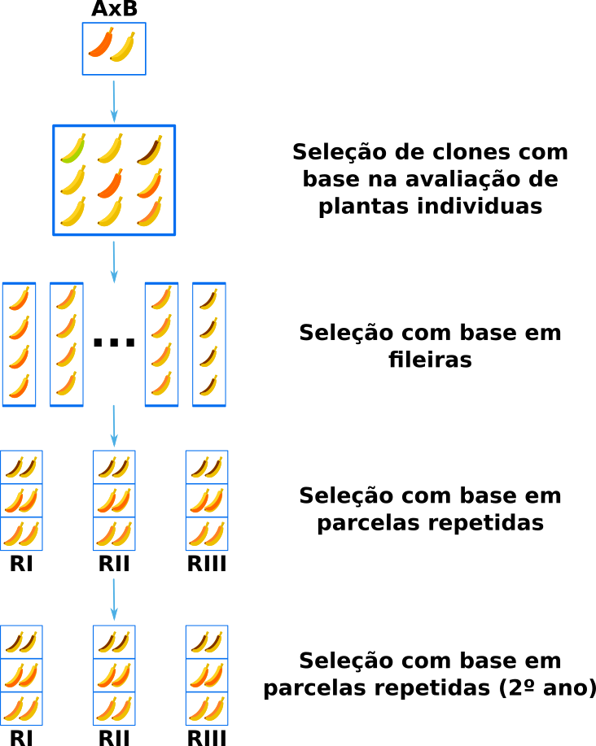
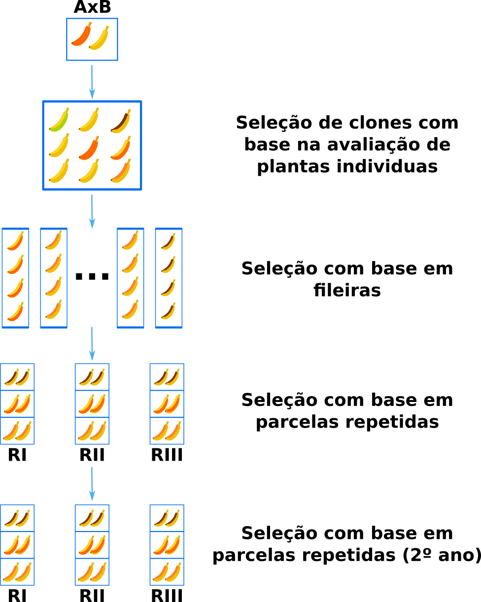
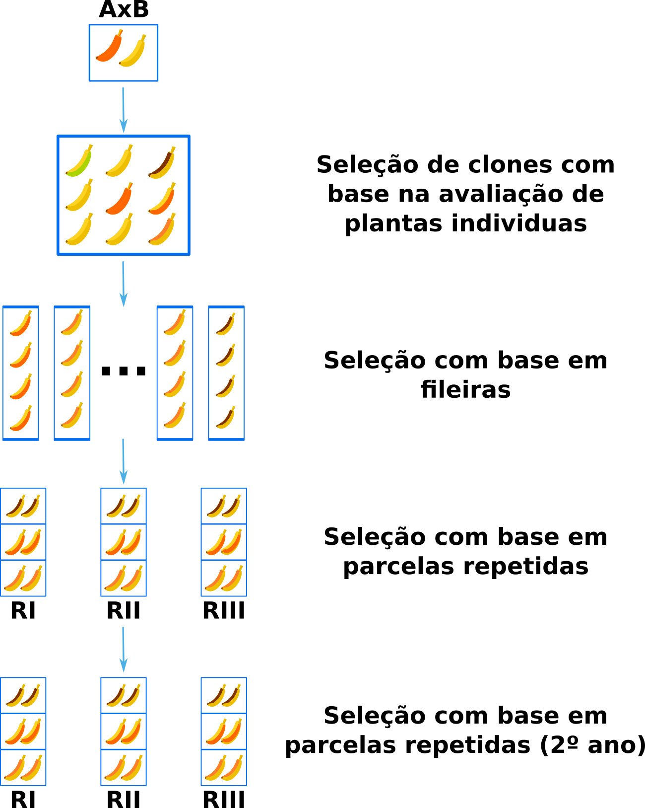
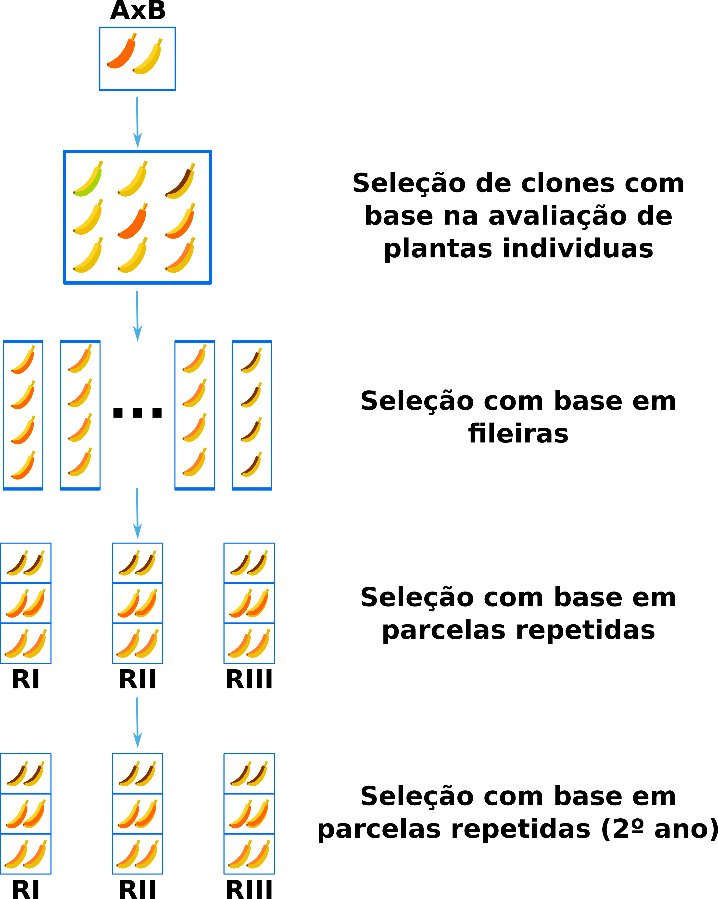

# genetica-quantitativa

## Métodos de Melhoramento

## Método da População

## Método Genealógico

## Método SSD

## Método SPD

## Teste de Geração Precoce

## Retrocruzamento

#### ldpi (low) ~120dpi

#### mdpi (medium) ~160dpi

#### tvdpi (tablet size) ~ 213 dpi

#### hdpi (high) ~240dpi

#### xhdpi (extra-high) ~320dpi

#### xxhdpi (extra-extra-high) ~480dpi

#### xxxhdpi (extra-extra-extra-high) ~640dpi

## Melhoramento de Clones

### ldpi (low) ~120dpi

### mdpi (medium) ~160dpi

### tvdpi (tablet size) ~ 213 dpi

### hdpi (high) ~240dpi

### xhdpi (extra-high) ~320dpi

### xxhdpi (extra-extra-high) ~480dpi

### xxxhdpi (extra-extra-extra-high) ~640dpi

