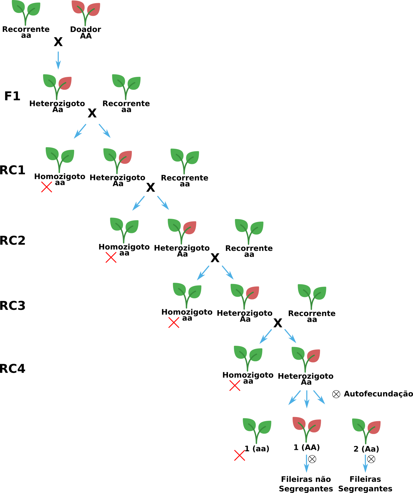

# Retrocruzamento

## Recorrente Recessivo

## ldpi (low) ~120dpi

### mdpi (medium) ~160dpi

### tvdpi (tablet size) ~ 213 dpi

### hdpi (high) ~240dpi

### xhdpi (extra-high) ~320dpi

### xxhdpi (extra-extra-high) ~480dpi

### xxxhdpi (extra-extra-extra-high) ~640dpi

## Recorrente Dominante

## ldpi (low) ~120dpi

### mdpi (medium) ~160dpi

### tvdpi (tablet size) ~ 213 dpi

### hdpi (high) ~240dpi

### xhdpi (extra-high) ~320dpi

### xxhdpi (extra-extra-high) ~480dpi

### xxxhdpi (extra-extra-extra-high) ~640dpi

