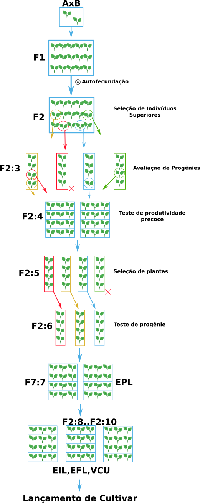
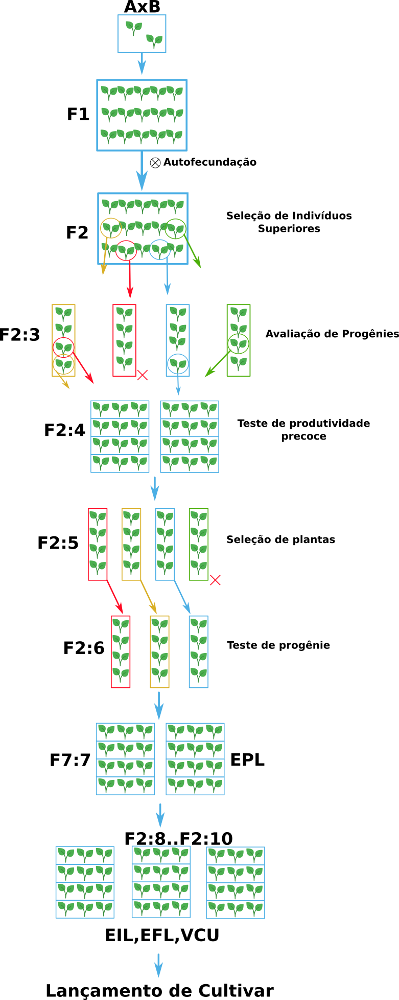
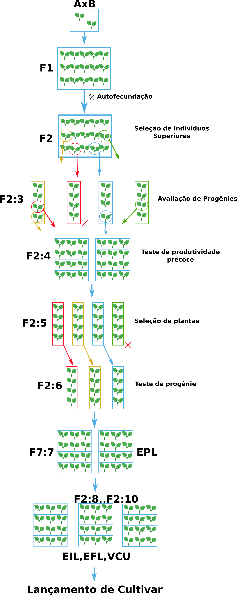

# Teste de Geração Precoce

## ldpi (low) ~120dpi

## mdpi (medium) ~160dpi

## tvdpi (tablet size) ~ 213 dpi

## hdpi (high) ~240dpi

## xhdpi (extra-high) ~320dpi

## xxhdpi (extra-extra-high) ~480dpi

## xxxhdpi (extra-extra-extra-high) ~640dpi

